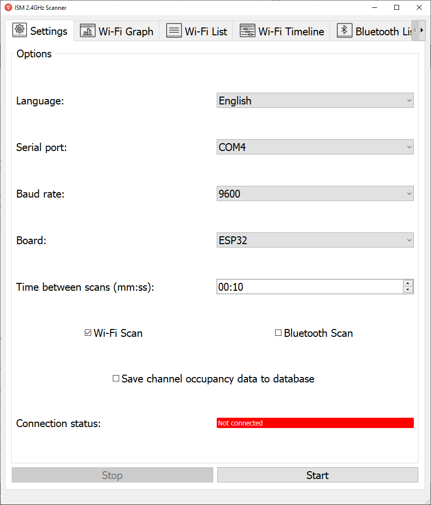
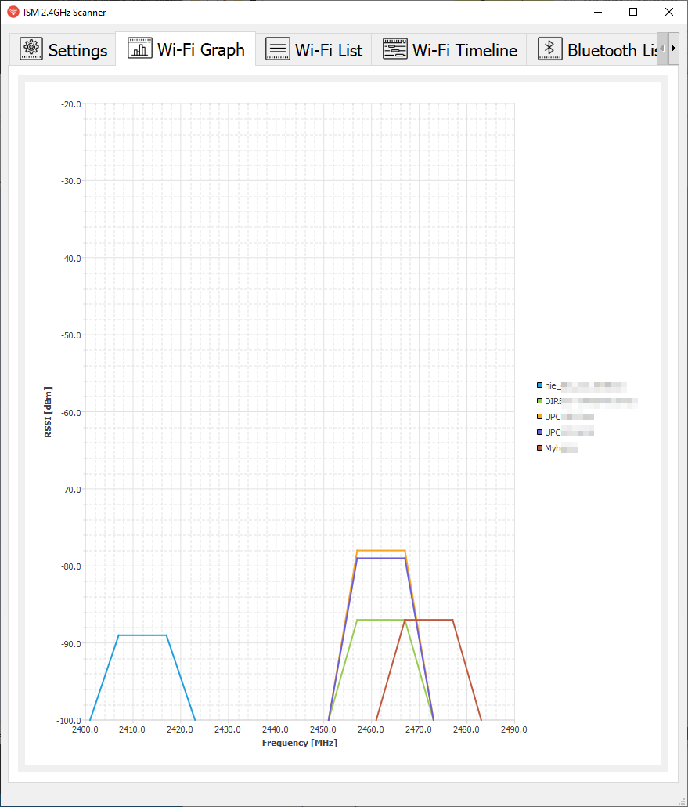
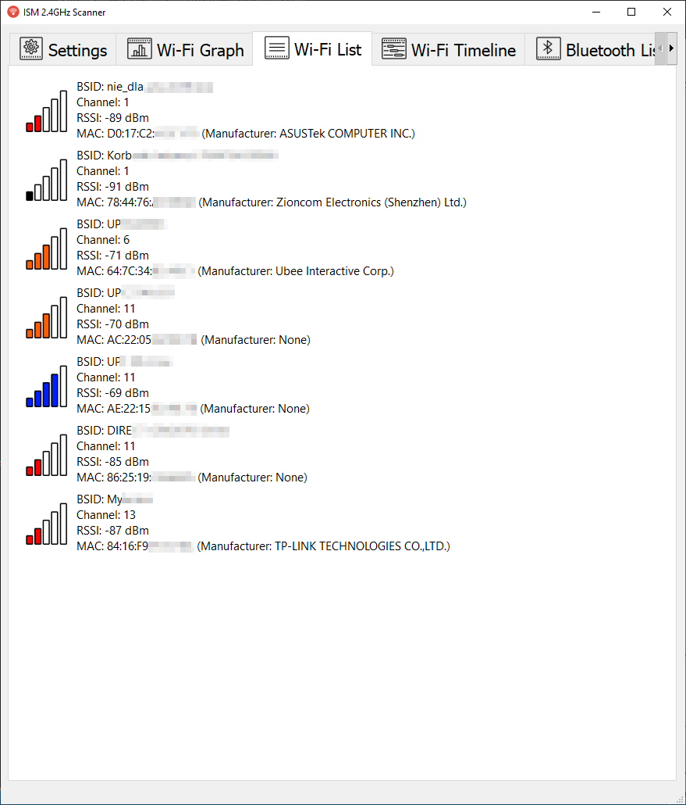
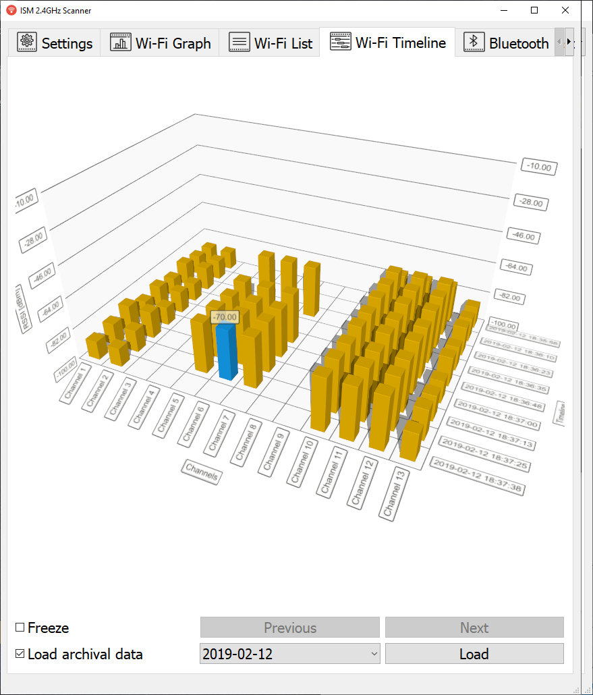
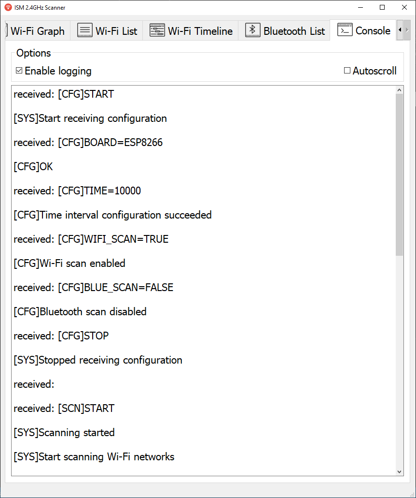

# ismScannner
Python application which allows to visualize and save to database Wi-Fi channel occupancy using ESP8266 or ESP32
## Table of contents

1. [Features](#features)  
2. [Screenshots](#screenshots)  
3. [Installation](#installation)  
    3.1. [Installation on ESP8266](#installation-on-esp8266)  
    3.2. [Installation on ESP32](#installation-on-esp32)  
4. [Used libraries](#used-libraries)  
     4.1. [Python 3.7 libraries](#python-3.7-libraries)  
     4.2. [Arduino libraries](#arduino-libraries) 

## Features
1. Settings Tab
    * automatically detects active serial port
    * multi-language support (English, Polish)
    * allows to configure ESP-x scan options, using GUI
    * allows save data to database file, which will be created in *user_data/database/*
    * shows current connection status
2. Wi-Fi Graph Tab
    * visualize active networks and which channel they occupied on a graph
3. Wi-Fi List Tab
    * shows list of active networks and their parameters (BSSID, Channel, RSSI, MAC addres, Manufacturer)
4. Wi-Fi Timeline Tab
    * 3D graph showing channel occupancy in time
    * if option *Save channel occupancy data to database* in *Settings* tab is selected, external data stored in database can be viewed, when *Load archival data* option is checked
    * graph can be stopped, which stops showing current measures (they still will be saved in memory or a database) and allows to move throught data
5. Bluetooth Tab
    * shows active Bluetooth devices (only when ESP32 is connected)
6. Console Tab
    * allows to view output from ESP-x
    * autoscroll option
    * if option *Enable logging* is selected, output will be saved in *user_data/logs*

## Screenshots

## Installation
### Installation on ESP8266

**Step 1.** Open File -> Preferences -> Additional Boards Manager URL's and add this link: `http://arduino.esp8266.com/stable/package_esp8266com_index.json`

**Step 2.** Open Tools -> Board -> Boards Manager and install *esp8266* library by *ESP8266 Community*

**Step 3.** Open sketch from *boards/esp8266* and click Upload button

### Installation on ESP32

**Step 1.** Open File -> Preferences -> Additional Boards Manager URL's and add this link: `https://dl.espressif.com/dl/package_esp32_index.json`

**Step 2.** Open Tools -> Board -> Boards Manager and install *esp32* library by *Espressif Systems*

**Step 3.** Open sketch from *boards/esp32* and click Upload button

## Used libraries
### Python 3.7 libraries

|Library|Version|License|
|-------|-------|-------|
|PySide2|5.11.2|LGPLv3|
|pyserial|3.4|BSD-3-Clause|

### Arduino libraries

|Library|Version|License|
|-------|-------|-------|
|esp82D66|2.4.2|LGPL-2.1|
|esp32|1.0.0| |

All icons used in project are from: [Icons8](https://icons8.com)
